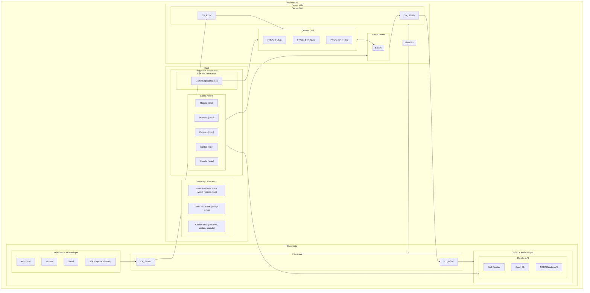

<!--
-->

```mermaid
%%  TB - (Top-Botom) horizontal
%%  LR - (Left-Right) vertical
flowchart
    subgraph PLATFORM ["Platform/OS"]
        %% direction TB
        %% direction LR
        subgraph HOST["Host"]
            direction TB
            subgraph MEM["Memory / Allocators"]
                direction LR
                HUNK["Hunk: fwd/back stack (world, models, bsp)"]
                ZONE["Zone: heap free (strings temp)"]
                CACHE["Cache: LRU (textures, sprites, sounds)"]
            end
            subgraph FS["Filesystem Resources"]
                %% direction LR
                subgraph PAK["PAK-file Resources"]
                    direction LR
                    PROG_DAT["Game Logic [prog.dat]"]
                end
                subgraph Assets["Game Assets"]
                    direction LR
                    MODEL["Models (.mdl)"]
                    TEXTURES["Textures (.wad)"]
                    PICS["Pictures (.lmp)"]
                    SPRITE["Sprites (.spr)"]
                    SOUND["Sounds (.wav)"]
                end
            end
        end

        subgraph SV["Server side"]
            %% direction LR
            subgraph PROG["QuakeC VM"]
                %% direction LR
                PROG_FUNC
                PROG_STRINGS
                PROG_ENTITYS
            end
            subgraph PHYS["PhysSim"]
            end
            subgraph WORLD["Game World"]
                subgraph EDICT["Entitys"]
                end
            end
            subgraph SV_NET["Server Net"]
                SV_SEND
                SV_RCIV
            end

            SV_RCIV --> PROG
            WORLD --> SV_SEND
            PROG <--> EDICT
            PROG_DAT --> PROG
            Assets --> WORLD
        end

        subgraph CL["Client side"]
            %% direction LR
            subgraph CL_INPUT["Keyboard + Mouse input"]
                %% direction LR
                KB["Keyboard"]
                MS["Mouse"]
                UART_IN["Serial"]
                SDL_IN["SDL2 Input Kb/Ms/Gp"]
            end
            subgraph CL_OUTPUT[Video + Audio output]
                %% direction LR
                subgraph R_API["Render API"]
                    %% direction LR
                    SR["Soft Render"]
                    GL["Open GL"]
                    SDL_OUT["SDL2 Render API"]
                end
            end
            subgraph CL_NET["Client Net"]
                %% direction LR
                CL_SEND
                CL_RCIV
            end
            CL_INPUT --> CL_SEND
            CL_RCIV --> CL_OUTPUT
        end

    end

    CL_NET <--> SV_NET
    SV_SEND --> CL_RCIV
    CL_SEND --> SV_RCIV

    Assets --> R_API

```
